# Play_now

## Содержание
- [Технологии](#технологии)
- [Начало работы](#разработка)
- [Визуал](#скриншоты)

## Технологии
  - [TypeScript](https://www.typescriptlang.org/)
  - [Webpack](https://webpack.js.org/)

### Требования
Для установки и запуска проекта, необходим [NodeJS](https://nodejs.org/) v8+.

## Разработка
### Установка зависимостей
Для установки зависимостей, выполните команду:
```sh
$ npm i
```
### Client
#### Запуск Development сервера
Чтобы запустить сервер для разработки, выполните команду:
```sh
npm run dev
```

### Создание билда
Чтобы выполнить production сборку, выполните команду: 
```sh
npm run build
```

### Backend
#### Инициализация
Для инициализации скачайте отдельно папку static, которая содержит статичные
файлы БД. Разархивируйте папку так, чтобы она была доступна по пути
/streaming_service_api/static. Ссылка на скачивание: https://drive.google.com/file/d/19Pmh_xuuXZYgqLCRpVuWxDXsfPcE0rnK/view?usp=sharing.

Когда папка будет на своём месте, можно выполнять команды по инициализации.
Миграция — процесс наполнения БД данными о музыке, исполнителях, обложках и так
далее. Её необходимо сделать единожды при инициализации БД.
```sh
npm install
```
```sh
npm run migration
```
#### Запуск сервера
```sh
npm run start
```
### Swagger
Для более удобной ориентации по API в рамках проекта добавлен пакет Swagger,
который позволяет потыкать API в удобном графическом интерфейсе. После запуска
бэкенда он будет доступен по адресу http://localhost:3000/api/.
Чтобы выполнять запросы, сначала авторизуйтесь. Для этого найдите роут
/api/auth/register. В ответе сервера на запрос о регистрации вы получите токен.
Скопируйте его и впишите в специальное поле, которое доступно в верхней части
страницы. Нажмите кнопку Authorize. После этого вы будете считаться залогиненным
пользователем и вам будут доступны все функции API.


## Скриншоты
  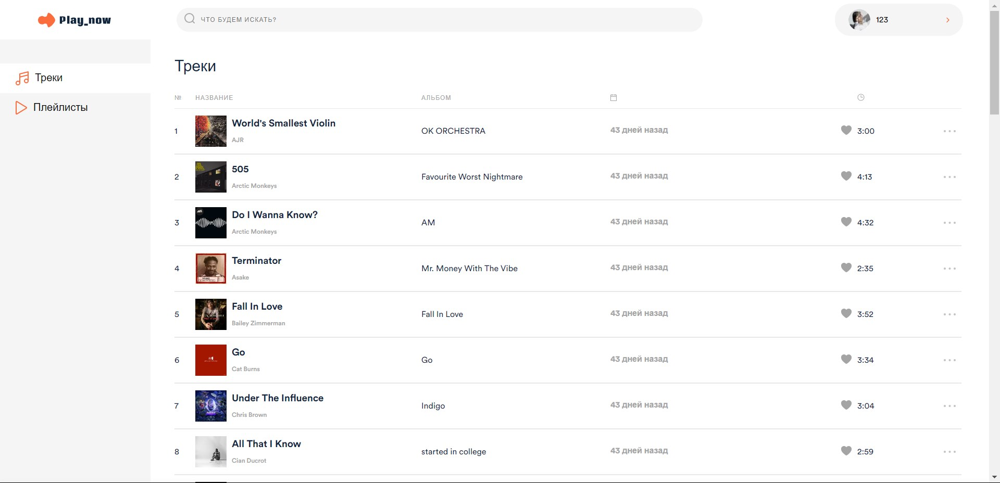
  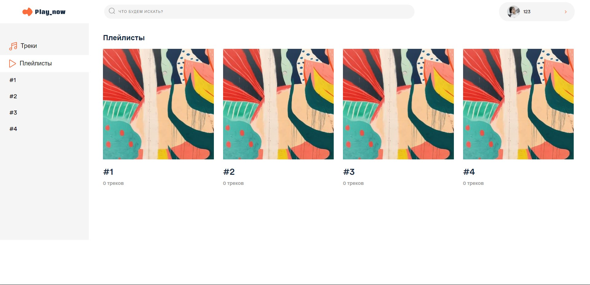
  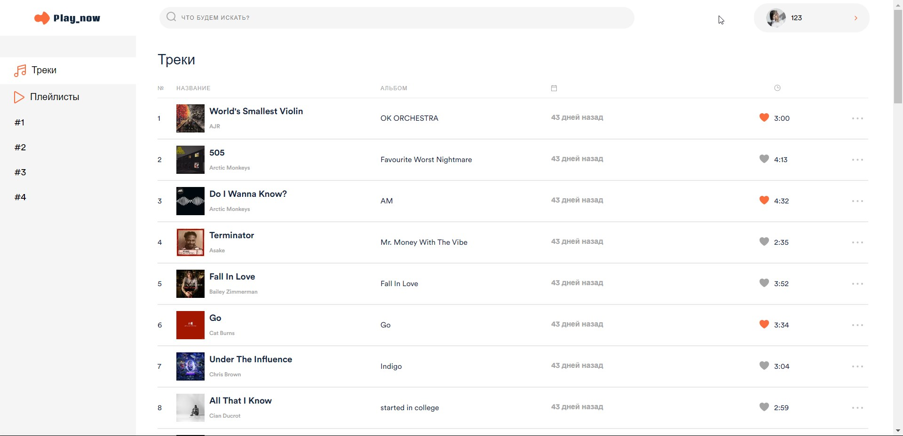
  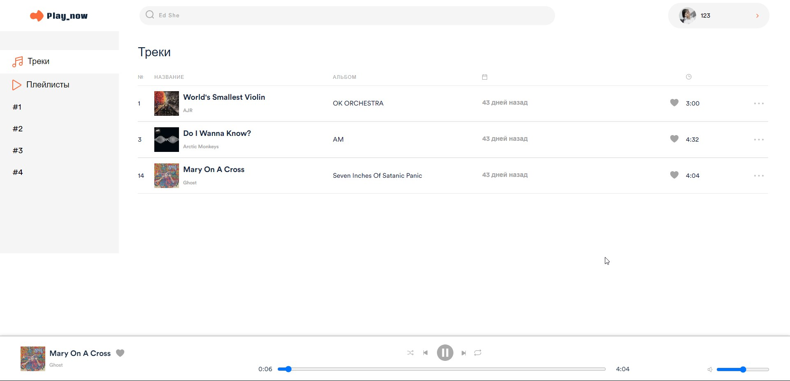
  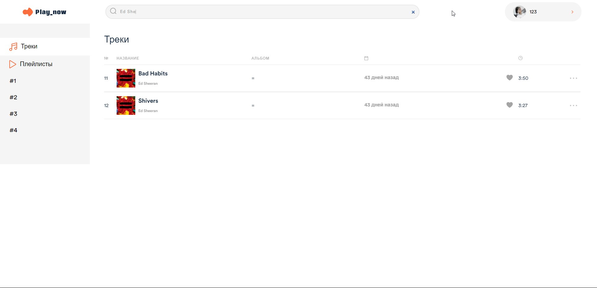
  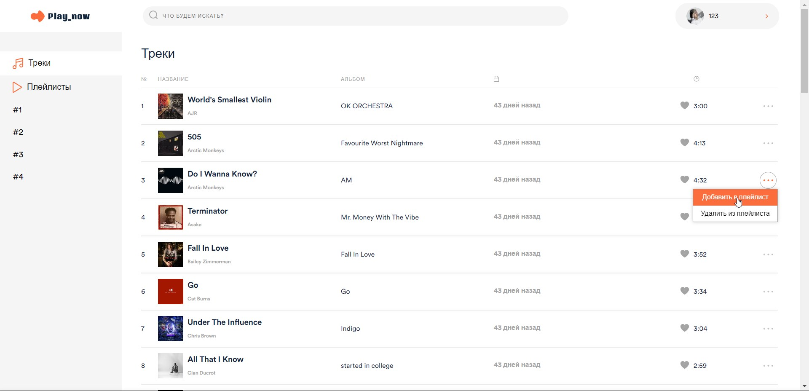
  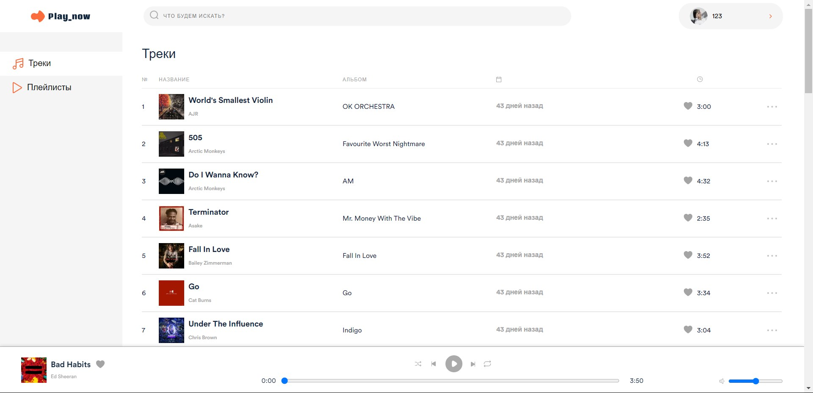
  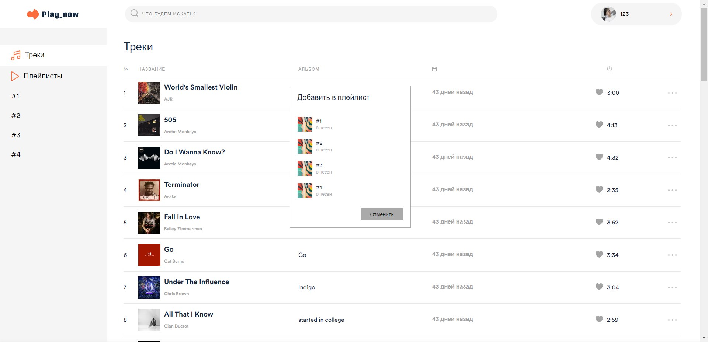
  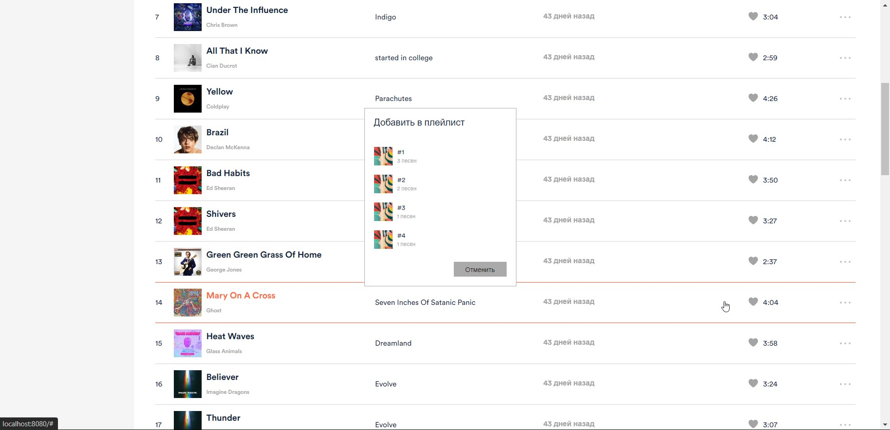
  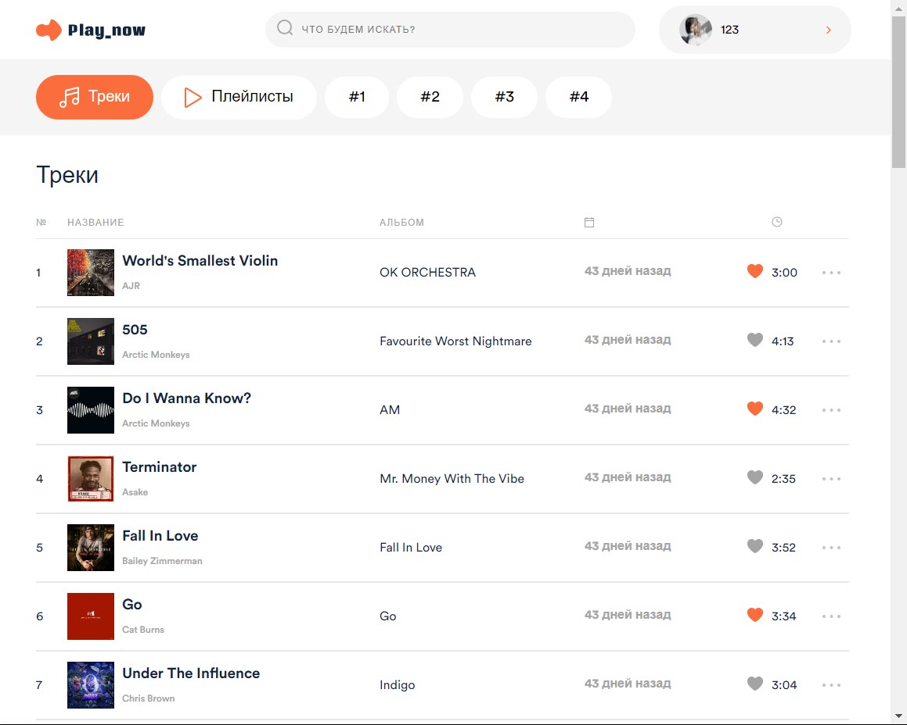
  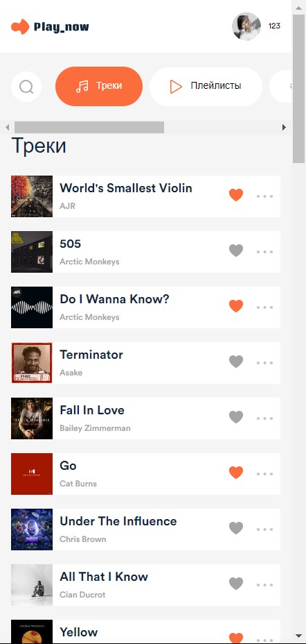
  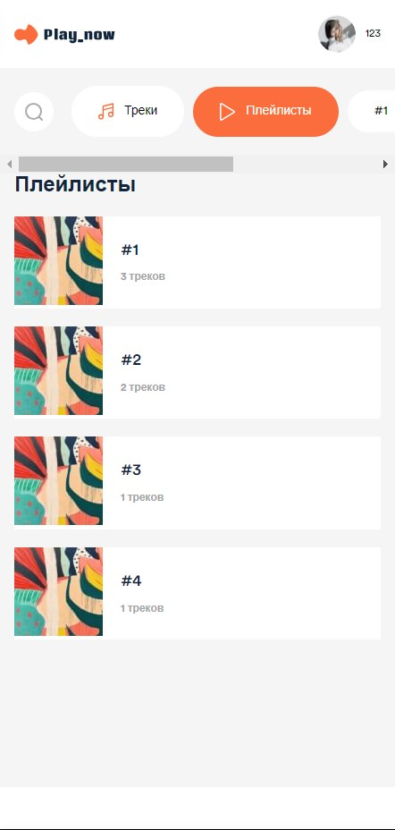
  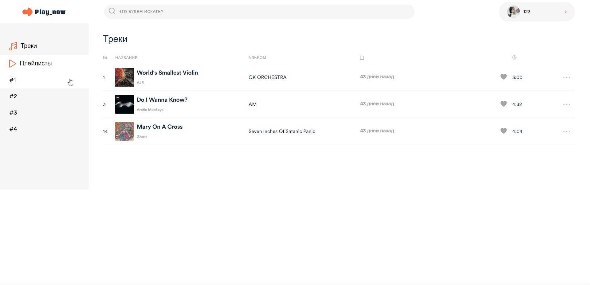
  

## Команда проекта
- [Артём Кряквин](https://t.me/art_kryy) — Frontend-developer
